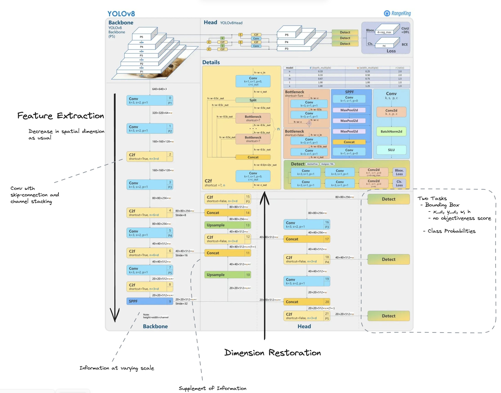

# Object Detection
 **Locate** objects and **classify** them. By the nature of the previous statement, it conducts two tasks: Regression and Classification. For sure, there are other models that approaches object detection in different perspectives. 

## Flow
 Image -> Plyaing with Feature -> Output vectors of shape we want

 ML models cannot understand image itself, requiring us to convert the format into some numbers, vectors, or tensors.

 In order to better understand the image and its characteristics, patterns, and features, we use model. For images, it's likely CNN or recently ViT(Vision Transformer).

 Once the feature is extracted and condensed well, we will be able to get a feature map which is of relatively low dimension compare to input. It might not the case especially if you are to conduct segmentations. But for the problem of object detection, it used to be. 

 We then, convert the feature map into some vector with shape of what we want. 
 For example, in object detection with YOLO, you will divide an image into $S \times S$ grid. Let's forget all the grid cells but one. 

  - The one cell you are looking at are obligated to generate $B$ number of bounding box
  - Each bounding box should return $5 + C$ values. For 5
    - center of x, center of y, width, and height of the bounding box (4)
    - objectiveness score, how likely the box contains an object (1)
    - probability distribution. If you have two classes of Cat and Dog, you will get distribution like [0.6, 0.4], if three, [0.1, 0.7, 0.2] ($C$)

As I know YOLOv8 does not have objectiveness score so it would be $4+C$. Nevertheless, what notable is that we want to change the shape of well extracted feature map into a vector with desired dimension.

## Detail of YOLOv8
Flow might be quite straightforward. Interesting activities happen around the **Feature Extraction**. Here we play with numbers comprising input images to detect their underlying traits. 

## Evaluation

$IoU$ measures the overlap between ground truth and prediction  
 - $IoU = \frac{A \cap B}{A \cup B}$  

$Precision$ means how much model correctly classified among predictions it made  
 - $Precision = \frac{TP}{TP + FP}$

$Recall$ is to how much captured among total ground truth  
 - $Recall = \frac{TP}{TP + FN}$

$F1$ scores both $Precision$ and $Recall$ with a single number. It is maximized when both values are euqally 1, and become minimized when either is 0. 
 - $F1 = 2 \times \frac{Precision \times Recall}{Precision + Recall}$

$mAP$ is mean Average Precision. mean for various classes and Average for varying precision-recall levels. 

If you will think a detection correct only if the $IoU$ is over 0.5, that measurement will be called $mAP_{50}$. You can feel that this is quite roughly measured. The $IoU$ value of 0.5 can be achieved when 2/3 of gt and prediction overlap. In the meanwhile, If you admit a prediction is correct if only the $IoU$ is over 0.95, it's called $mAP_{95}$. Thus, If you look at $mAP_{50-95}$, you can have a balanced view.
