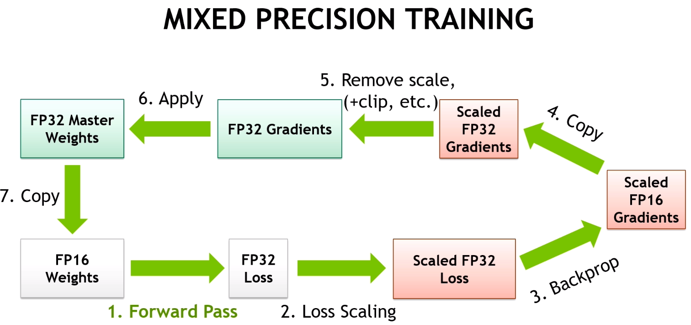

# LLM

## FP16
Intuitive vibe it gives is something is havled from FP32.
In a numbering system with FP32, 32 bits are needed to express one number, 1bit used for sign, 8bit for exponent, and 23 bit for mantissa.

| Precision \ Item  | Sign | Exponent |  Mantissa  |
|-------|--------|---------|----------|
| FP32  | 1 bit  |   8bit  |   23 bit   |
| FP16  | 1 bit  |   5bit  |   10 bit   |

How it's actually different from FP32? 
  - Numerical Range a precision level can express is different, which might result in difference especially in large/accumulated matrix multiplication due to round-off 
    - FP16: $ -6.55 \times 10^{4}  \text{ to }  6.55 \times 10^{4} $
    - FP32: $-3.4 \times 10^{38} \text{ to } 3.4 \times 10^{38}$
  - Memory usage / Speed accordingly will be less required at a cost of precision. 
  - However, this does not mean that FP16 does always impact a model's performance significantly. If our use case requires less sophisticated computation, the repercussion small delta brings can be minimized.
  - Or we might experience a better training due to the increased batch size. 

### Mixed-precision
Is there a way to cherry-pick both FP16 and 32? We might also consider mixed-precision. The assence is to use FP16 for most of the forward/backward operations, while FP32 is applied to operations requiring more accurate computation such as updating weights and gradient accumulation.

In addition, the loss calculated by FP16 will be scaled up. I should remebmer that the range FP16 can express is narrower, which might lead to a vanishing gradient.

